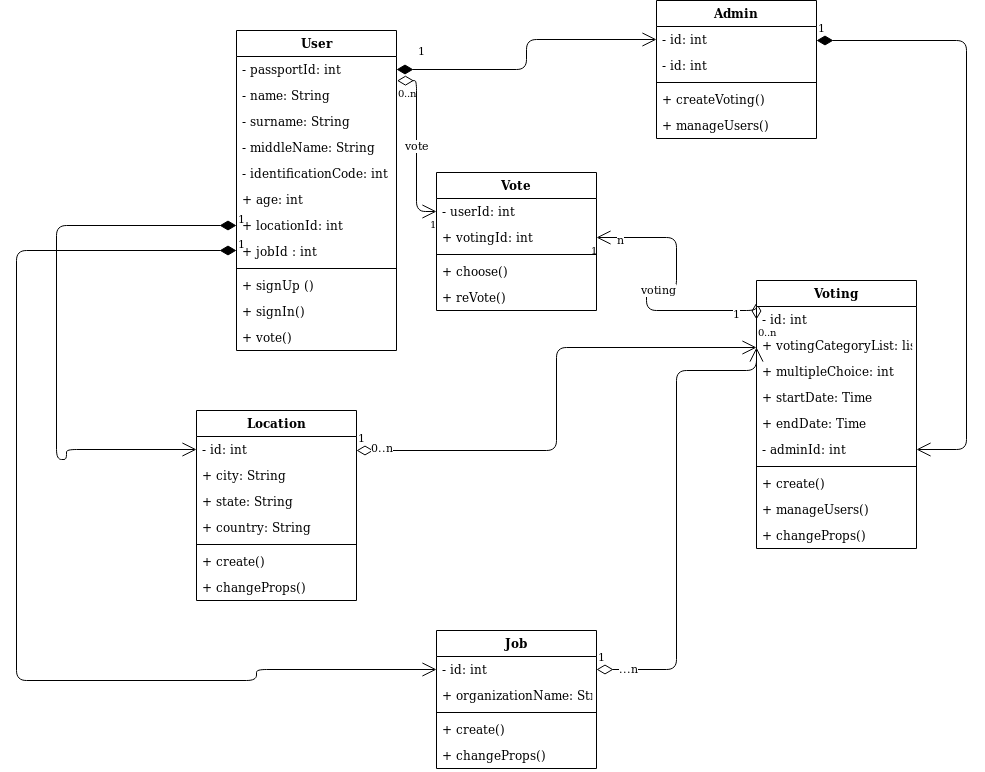
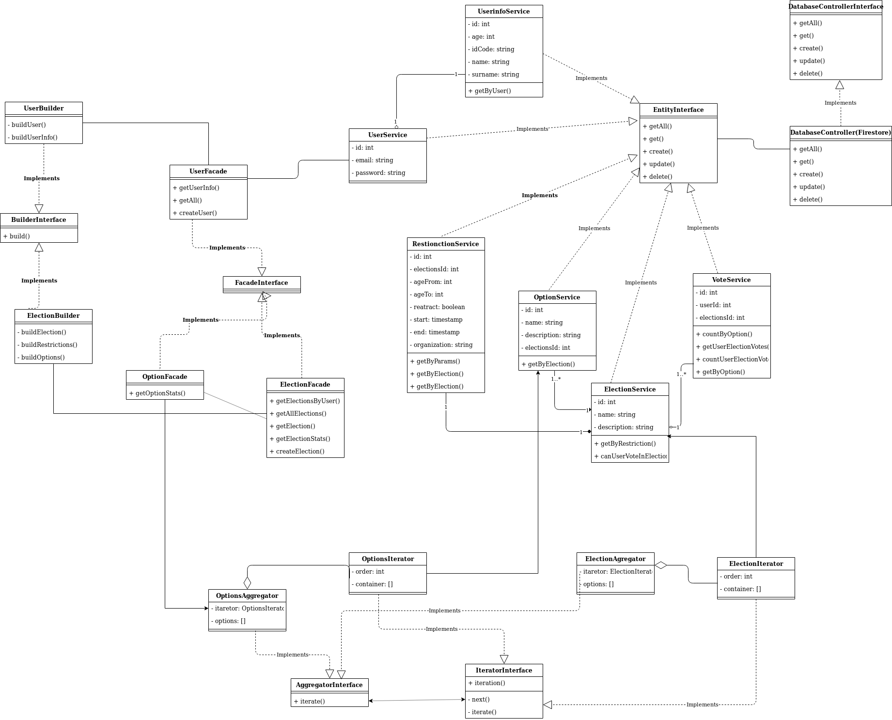

# Open election system

## The Aim of the project

The project is created in order to practice using design patterns in backend development.

## Project setup

### Adding secret keys
In the root directory, create a file **env_variables.yaml** and paste the following content to it:

```shell
env_variables:
  FIREBASE_PROJECT_ID: 'project_id'
  GAE_USE_SOCKETS_HTTPLIB : 'true'
```
In the root directory, create a file **key.json** and paste Firebase key to it.

### Running a project

### ubuntu
```shell
virtualenv -p python3 .venv
source .venv/bin/activate
python3 setup.py develop
gunicorn --bind 0.0.0.0:8080 wsgi
```
### windows
```shell
python3 -m venv venv
\venv\Scripts\activate.bat
python3 setup.py develop
python3 wsgi.py
```

### Explore Swagger

<p>Local version: https://0.0.0.0:8080/api/1/ </p>
<p>Development version: https://lyrical-amulet-276713.ew.r.appspot.com/api/1/ </p>

## Project devlopment

## Adding changes:

If you add a new package, you should update **requirements.txt**:
```
pip freeze > requirements.txt
```

All changes in the **dev** branch, automatically deploy to Google App Engine.

## Project structure

### Patterns
#### Architecture-level patterns: 
- Model-View-Presenter architecture
- Inversion of Control with IoC Container and Dependency Injection

#### Business logic patterns
- Facade
- Builder
- IoC and DI
- Decorator
- Serializer
- Application factory


### Diagrams
#### Use case diagram


#### Class diagram


#### Design pattern class diagram



## Technologies

The following technologies were used:
#### Backend:
- python3
- flask
#### Database:
- Firestore
#### Development
- Google cloud platform, App Engine